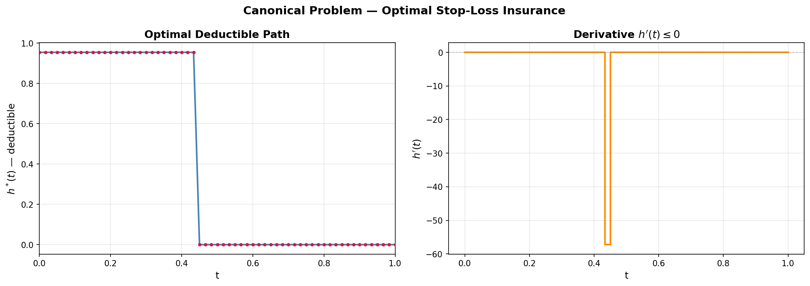
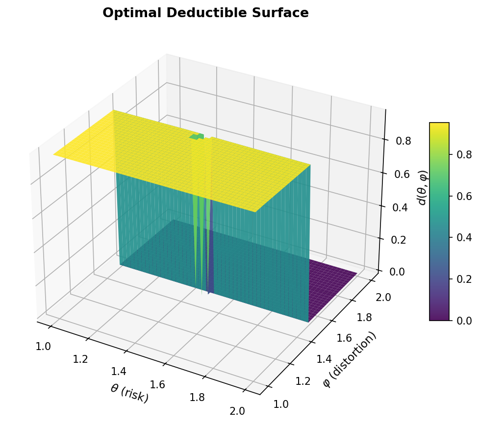
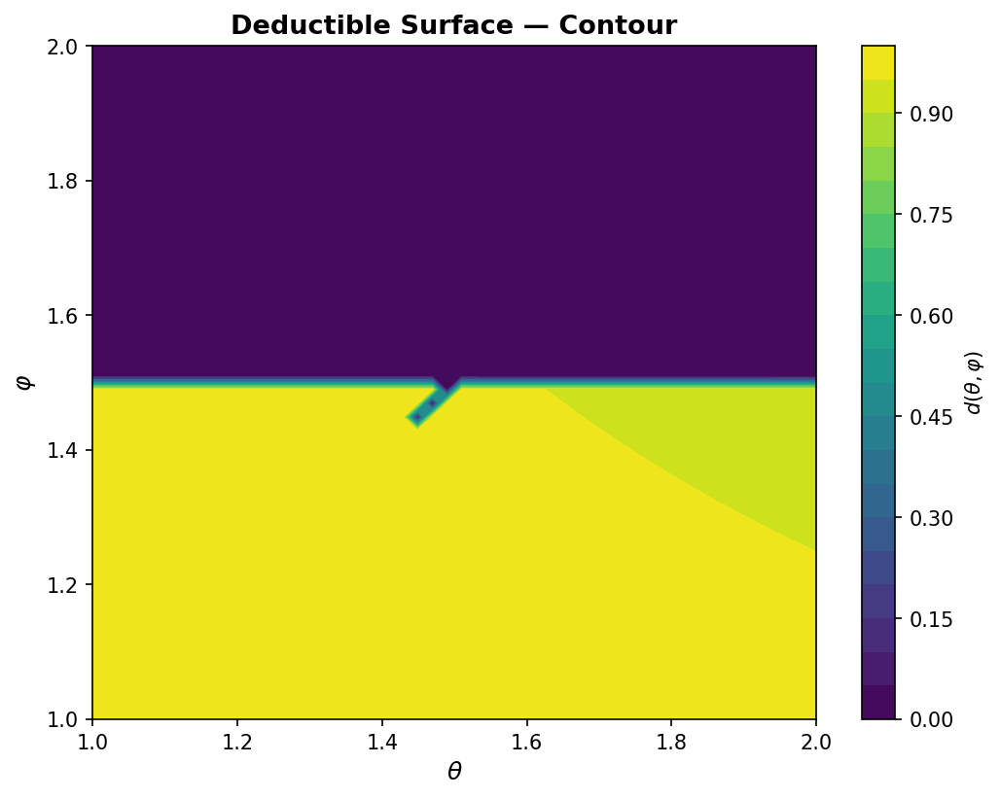
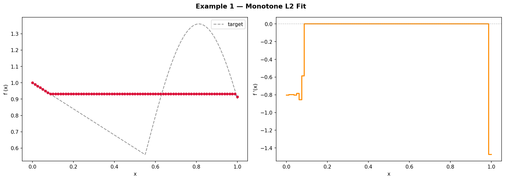
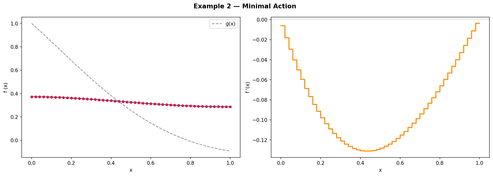
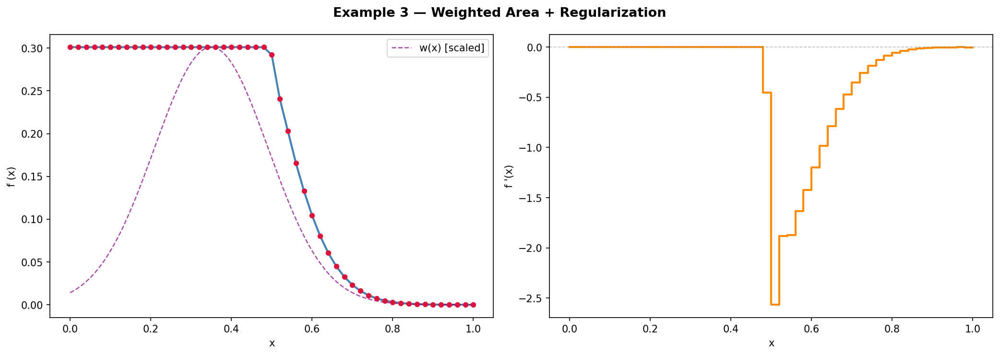
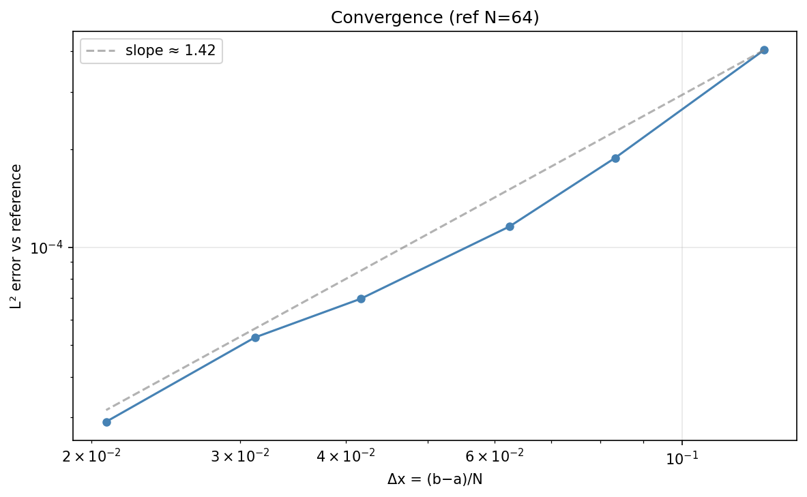

# monotone-functional-optimizer

**Numerical optimization of one-dimensional variational problems under monotonicity constraints.**

$$
\max_{f\;:\;f' \le 0}\;\; \int_a^b P\!\bigl(x,\,f(x),\,f'(x)\bigr)\,dx
\quad\text{or}\quad
\min_{f\;:\;f' \le 0}\;\; \int_a^b P\!\bigl(x,\,f(x),\,f'(x)\bigr)\,dx
$$

With **free boundary conditions** at both endpoints. The monotonicity direction
is configurable ($f' \le 0$ or $f' \ge 0$).

This solver is the numerical core of:

> Mai Zhang & Ka Chun Cheung, *Optimal Insurance: Adverse Selection for
> 2-dimension continuous types* — Sections 5–6.

---

## Table of Contents

1. [Canonical problem: Optimal Stop-Loss Insurance](#canonical-problem)
2. [Quick start](#quick-start)
3. [Method](#method)
4. [Additional examples](#additional-examples)
5. [Convergence analysis](#convergence)
6. [API reference](#api-reference)
7. [Installation](#installation)

---

## Canonical Problem

### Optimal Stop-Loss Insurance under 2D Adverse Selection

The **canonical example** solves for the optimal deductible schedule $h: [0,1] \to [0, L_{\text{bar}}]$ in a two-dimensional adverse-selection insurance market.

#### Type space

Insureds are characterized by a **risk parameter** $\theta \in [1, 2]$ and a **distortion parameter** $\varphi \in [1, 2]$, both uniformly distributed. Types are ordered along the diagonal:

$$
\theta_t = 1 + t,\qquad \varphi_t = 1 + t,\qquad t \in [0, 1].
$$

#### Primitives

| Symbol | Specification |
|--------|--------------|
| Loss CDF | $H_{\theta}(l) = 1 - e^{-l/\theta}$ |
| Distortion | $g_{\varphi}(p) = p^{\varphi}$ |
| Deductible bound | $L_{\text{bar}} = 10$ |

#### Key derived quantities

**Diagonal surplus** — the "binding value" along the type diagonal:

$$
G(t) = g_{\varphi_t}\!\bigl(H_{\theta_t}(h(t))\bigr) = \bigl(1 - e^{-h(t)/(1+t)}\bigr)^{\,1+t}
$$

**Level-set map** $F_1(\theta, t)$ — the $\varphi$-value that makes type $\theta$'s
binding equal to $G(t)$:

$$
F_1(\theta, t) = \frac{\ln G(t)}{\ln\!\bigl(1 - e^{-h(t)/\theta}\bigr)}
$$

#### Objective (maximize insurer surplus)

$$
\Pi[h] = \int_0^1 P\!\bigl(t,\,h(t),\,h'(t)\bigr)\,dt \;+\; \bigl(1 - M(\underline{\varphi})\bigr)\!\int_0^{h(0)} g_{\underline{\varphi}}\!\bigl(H_{\underline{\theta}}(l)\bigr)\,dl
$$

where $P(t, h, h')$ contains four terms encoding the virtual surplus
adjusted for incentive effects:

$$
\begin{aligned}
P(t, h, h') = &
\int_{\underline{\theta}}^{\overline{\theta}}
   \frac{\partial F_1(\theta,t)}{\partial t}\,
   \left[-h + \theta\bigl(1 - e^{-h/\theta}\bigr)\right] d\theta \\[4pt]
&-\; G(t)\left[\int_{\underline{\theta}}^{\overline{\theta}}
   (2-\theta)\,\frac{\partial F_1(\theta,t)}{\partial \theta}\,d\theta\right] h' \\[4pt]
&+\; G(t)\,\bigl(2 - F_1(\underline{\theta}, t)\bigr)\,h'
\end{aligned}
$$

The second term in the general form vanishes because $F(\underline{\theta}) = F(1) = 0$.

**Boundary term** — profit from the lowest-risk type:

$$
\bigl(1 - M(\underline{\varphi})\bigr)\!\int_0^{h(0)} g_{\underline{\varphi}}\!\bigl(H_{\underline{\theta}}(l)\bigr)\,dl
= h(0) - 1 + e^{-h(0)}
$$

#### Constraints

$$
0 \le h(t) \le L_{\text{bar}} = 10,\qquad h'(t) \le 0 \quad\text{(incentive compatibility)}
$$

#### Numerical solution ($N = 60$, inner $\theta$-quadrature: 30 nodes)

| Quantity | Value |
|----------|-------|
| $\Pi^*$ (max surplus) | **0.0536** |
| $h^*(0)$ | 0.954 |
| $h^*(1)$ | 0.000 |
| SLSQP iterations | 69 |
| Monotonicity | ✓ satisfied |



**Interpretation.** The optimal deductible is approximately **flat at $h \approx 0.95$**
for the lower half of the type spectrum ($t \lesssim 0.45$), then drops sharply
to **full coverage ($h = 0$)** for higher-risk types. This "bunching + jump"
structure is characteristic of one-dimensional screening with a binding
monotonicity constraint: low-risk types are pooled at a moderate deductible,
while high-risk types receive near-complete coverage.

The $L_{\text{bar}} = 10$ bound is **not binding** at the optimum — the
informational rent effect (terms involving $h'$ and $\partial F_1/\partial\theta$)
strongly penalizes high deductibles, pushing the solution toward the interior.

#### Reconstructed 2D deductible surface

The deductible $d(\theta, \varphi)$ for off-diagonal types is recovered by
inverting the level-set equation $F_1(\theta, t) = \varphi$:





The surface is decreasing in both $\theta$ and $\varphi$ — higher-risk,
higher-distortion types receive lower deductibles (more coverage).

---

## Quick Start

```python
from problem import Problem
from solver import solve
from plots import plot_both

# Define your integrand P(x, f, f')
def P(x, f, fp):
    return f - 0.5 * 0.3 * fp * fp

# Set up the problem
prob = Problem(
    P=P,
    a=0.0, b=1.0,       # interval
    N=50,                # subintervals → 51 variables
    maximize=True,       # maximize the integral
    monotone="nonincreasing",
)

# Solve
res = solve(prob)
print(res.success)       # True
print(res.x[0])          # f(a)
print(res.x[-1])         # f(b)

# Plot
plot_both(prob, res.x)
```

Run the canonical problem:

```python
from canonical import solve_canonical
res = solve_canonical(N=60, inner_n=30)
# res.objective_value → Π (max surplus)
# res.h_opt           → optimal h vector
```

---

## Method

### Discretization — piecewise-linear finite elements

The interval $[a, b]$ is divided into $N$ equal subintervals of length
$\Delta x = (b-a)/N$. The unknown function $f$ is represented by its nodal values

$$
h_i = f(x_i),\qquad x_i = a + i\cdot\Delta x,\qquad i = 0, \dots, N.
$$

Between nodes, $f$ is linearly interpolated; consequently, $f'$ is
**piecewise constant**:

$$
f_h'(x) = \frac{h_{i+1} - h_i}{\Delta x}
\quad\text{on}\quad (x_i, x_{i+1}).
$$

The monotonicity constraint $f' \le 0$ collapses to $N$ **linear inequalities**:

$$
h_i \ge h_{i+1}, \qquad i = 0, \dots, N-1.
$$

### Numerical quadrature — Gauss–Legendre

On each subinterval, the integral is evaluated with a $k$-point Gauss–Legendre
rule (default $k = 3$, exact for polynomials of degree $\le 5$):

$$
\int_{x_i}^{x_{i+1}} g(x)\,dx
\;\approx\;
\frac{\Delta x}{2} \sum_{j=1}^{k} w_j\;
g\!\left(\frac{x_i + x_{i+1}}{2} + \frac{\Delta x}{2}\,\xi_j\right).
$$

For problems with **nested integrals** (like the canonical insurance problem),
an inner Gauss–Legendre quadrature over $\theta$ is used inside the outer
$t$-integral. This is handled transparently by the integrand closure.

### Optimization — SLSQP

The discrete problem

$$
\min_{h \in \mathbb R^{N+1}}\; \pm\sum_{i=0}^{N-1}
\int_{x_i}^{x_{i+1}} P\bigl(x,\, f_h(x),\, f_h'(x)\bigr)\; dx
\quad\text{s.t.}\quad
h_0 \ge h_1 \ge \dots \ge h_N
$$

is solved with **SLSQP** (Sequential Least Squares Programming) via
`scipy.optimize.minimize`. The sign is $-$ for maximization, $+$ for
minimization. If SLSQP fails, `solve_auto` falls back to `trust-constr`.

---

## Additional Examples

### 1. Monotone $L^2$ fit

Find the non-increasing function that best approximates a target $g(x)$:

$$
\min_{f' \le 0}\;
\int_0^1 \bigl[f(x) - g(x)\bigr]^2\; dx.
$$

```python
def target(x):
    return np.where(x < 0.55,
                    1.0 - 0.8 * x,
                    0.56 + 0.8 * np.sin(6 * (x - 0.55)))

def P(x, f, fp):
    return (f - target(x)) ** 2

prob = Problem(P=P, a=0.0, b=1.0, N=80, maximize=False)
res = solve(prob)
# success=True, nit=43, J=0.0594
```



The optimal $f$ follows the target where it decreases, then **flattens**
through the rising portion — the constraint $f' \le 0$ binds exactly where
the target rises.

---

### 2. Minimal action with potential

$$
\min_{f' \le 0}\;
\int_0^1 \left[\,\frac{1}{2}\,f'(x)^2 + \frac{1}{2}\,\bigl(f(x) - g(x)\bigr)^2\right]\; dx.
$$

The unconstrained Euler–Lagrange equation is

$$
f''(x) - f(x) = -g(x),\qquad f'(0) = f'(1) = 0.
$$

With $g(x) = e^{-1.5x}\cos(2x)$ (already non-increasing), the constraint
is **inactive** — the unconstrained minimizer automatically satisfies $f' \le 0$.

```python
def g(x):
    return np.exp(-1.5 * x) * np.cos(2.0 * x)

def P(x, f, fp):
    return 0.5 * fp**2 + 0.5 * (f - g(x))**2

prob = Problem(P=P, a=0.0, b=1.0, N=50, maximize=False)
res = solve(prob)
# success=True, nit=65, J=0.0502
```



---

### 3. Weighted area with quadratic regularization

$$
\max_{f' \le 0}\;
\int_0^1 \Bigl[\,w(x)\,f(x) - \tfrac{\beta}{2}\,f(x)^2\Bigr]\; dx,
\qquad
w(x) = \exp\!\bigl(-25\,(x-0.35)^2\bigr).
$$

The $-\frac{\beta}{2}f^2$ regularizer keeps the objective bounded.
The optimum concentrates $f$ where the weight $w(x)$ peaks.

```python
def w(x):
    return np.exp(-25 * (x - 0.35)**2)

def P(x, f, fp):
    return w(x) * f - 0.5 * 2.0 * f**2

prob = Problem(P=P, a=0.0, b=1.0, N=50, maximize=True)
res = solve(prob)
# success=True, nit=45, max ∫P = 0.0495
```



---

## Convergence

The piecewise-linear discretization is $\mathcal O(\Delta x)$ accurate in $L^2$
norm, matching the theoretical rate for linear finite elements.

| $N$ | $\Delta x$ | $L^2$ error | rate |
|-----|------------|-------------|------|
| 8   | 0.125     | $4.0\times 10^{-4}$ | — |
| 12  | 0.083     | $1.9\times 10^{-4}$ | 0.77 |
| 16  | 0.063     | $1.2\times 10^{-4}$ | 0.85 |
| 24  | 0.042     | $6.9\times 10^{-5}$ | 0.92 |
| 32  | 0.031     | $5.3\times 10^{-5}$ | 0.83 |
| 48  | 0.021     | $2.9\times 10^{-5}$ | 0.95 |

**Empirical convergence rate $\approx 1.0$** (log–log slope).



---

## API Reference

### `Problem`

```python
@dataclass
class Problem:
    P:        Callable[[float, float, float], float]  # integrand
    a:        float                                    # left endpoint
    b:        float                                    # right endpoint
    N:        int                                      # number of subintervals
    maximize: bool = True                               # max / min
    monotone: str = "nonincreasing"                     # or "nondecreasing"
```

Properties: `dx`, `x_nodes`, `n_vars`.

### `solve`

```python
def solve(problem, quad_order=3, method="SLSQP",
          h0=None, lb=None, ub=None, options=None) -> OptimizeResult
```

Returns `scipy.optimize.OptimizeResult`, augmented with `result.problem`.

### `solve_auto`

```python
def solve_auto(problem, methods=("SLSQP", "trust-constr"), ...) -> OptimizeResult
```

Tries each method in order; returns the first successful result.

### Canonical problem

```python
from canonical import solve_canonical, make_canonical_P, reconstruct_surface

res = solve_canonical(N=60, inner_n=30, outer_quad_order=5, L_bar=10.0)
# res.objective_value → Π (max surplus)
# res.h_opt           → optimal h vector (ndarray, N+1)

P = make_canonical_P(inner_n=30)  # standalone integrand
theta_g, phi_g, surface = reconstruct_surface(res.h_opt)
```

### Plotting

| function | what it draws |
|----------|---------------|
| `plot_solution(problem, h_opt)` | $f(x)$ — piecewise-linear with nodes |
| `plot_derivative(problem, h_opt)` | $f'(x)$ — piecewise-constant step |
| `plot_both(problem, h_opt)` | side-by-side: $f$ and $f'$ |
| `plot_convergence(problem, N_list)` | $L^2$ error vs $\Delta x$ |

---

## Installation

```bash
git clone git@github.com:zhangmai19/monotone-functional-optimizer.git
cd monotone-functional-optimizer
pip install -r requirements.txt
```

**Requirements:** `numpy ≥ 2.0`, `scipy ≥ 1.12`, `matplotlib ≥ 3.8`.

---

## File Structure

```
├── problem.py         # Problem definition (dataclass)
├── quadrature.py      # Gauss–Legendre per-interval integration
├── objective.py       # Scalar objective J(h) for scipy
├── solver.py          # Constraint assembly + SLSQP/trust-constr
├── canonical.py       # Canonical insurance problem (all components)
├── plots.py           # Visualization (f, f', convergence)
├── experiments.py     # Example gallery + convergence study
├── requirements.txt
└── README.md
```

---

## Mathematical Background

This solver addresses problems of the form

$$
\max_{f}\; \int_a^b P(x, f, f')\,dx,\quad f' \le 0,
$$

which arise in:

- **Monotone regression** — $P = -(f - g)^2$, best non-increasing $L^2$ fit.
- **Calculus of variations** — $P = L(x, f, f')$, a Lagrangian with a
  **unilateral** constraint on the derivative.
- **Optimal control / screening** — $f$ as a state variable (e.g., a contract
  schedule), $f' \le 0$ as incentive compatibility. The canonical insurance
  problem (Sections 5–6 of Zhang & Cheung) is the flagship application.
- **Shape-constrained estimation** — density estimation under monotonicity.

The inequality $f' \le 0$ introduces a **complementary slackness** term in the
Euler–Lagrange equation, yielding an **obstacle-type** variational inequality.
The piecewise-linear discretization reduces this to a finite-dimensional
constrained nonlinear program.

### Limitations (current version)

- No integral constraints $\int g(x, f, f')\,dx \le C$
- No two-sided bounds on $f'$ (only one-sided monotonicity)
- No higher-order derivatives ($f''$)
- No automatic/analytic differentiation of $P$ (finite differences used internally)
- SLSQP scales to $N \lesssim 200$ in practice; for larger $N$, IPOPT or a
  dedicated QP solver is recommended

---

## License

MIT
